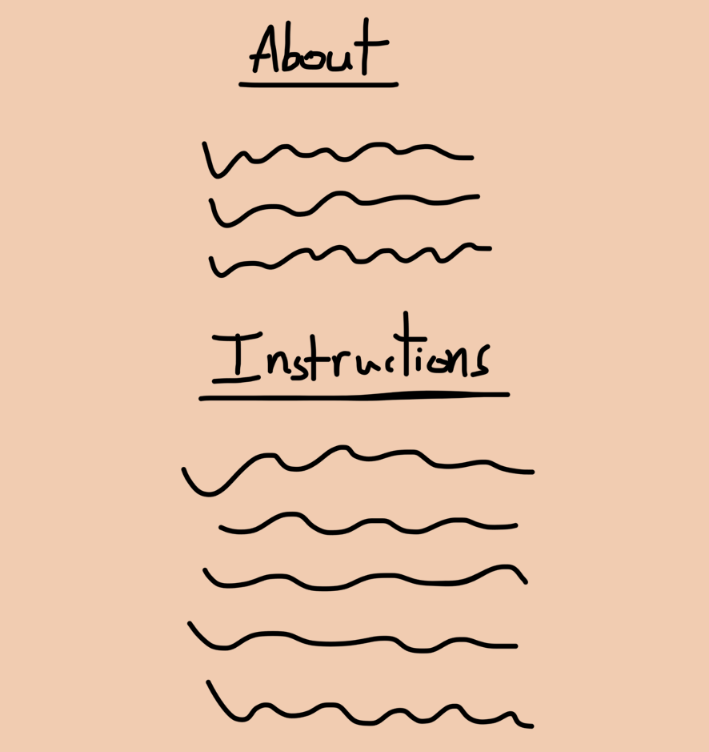
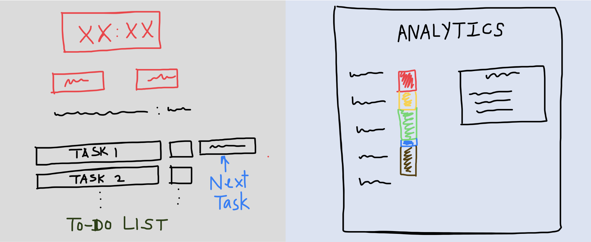

# PomoHero - A Pomodoro Timer App

In the world, many individuals and groups struggle with structured time management, keeping focus on important tasks, being held accountable for their mistakes, and learning from past experiences.

Many Pomodoro apps exist out there that tend to have too many overly-complicated features...

Or lack critical features that help analyze time management...

Or are inherently too distracting...

These apps are not allowing us to focus and concentrate effectively. Giving us the ability to pause the timer while working if we get distracted, or trying to visually satisfy us with unnecessary graphics achieves results contrary to what the Pomodoro Technique is meant to produce. If we can allow us to get distracted while working, we might as well not use the app at all! Also, giving us choices for customizability leads to unaccounted investments of time which we hadn't signed up for.

It is now time to right the wrongs.

## PomoHero

Our team came up with a solution idea that aims to incorporate the Pomodoro Technique to the fullest, automating as much as possible to make it easy for the user, keeping it simple to avoid distracting the user, and provifing clear analytics of both completions and mistakes to aid the user in learning better time management.

We have decided to go forward with the idea as a small-batch three-week project.

Here's how it works:

The app will have all of the basic functionality that the Pomodoro Technique lists. It will have a *Start* and a *Reset* button. Each individual Pomodoro session will be 25 minutes long, with a short break that is 5 minutes long after every Pomodoro session, and a long break that is 30 minutes long after 4 Pomodoro sessions have been completed...

In order to accomodate tight working schedules, the users will be provided an *End* button which will reset the count of the number of Pomodoro sessions, congratulate and reward the user on completing the number of Pomodoro sessions they did complete, and reset the timer. This will mark the end of the usage of the app currently as seen below...

A product is incomplete without a section that tells its users why they should use the app and the instructions that guide them through it. Many of our target users may not know about the Pomodoro Technique and it will be helpful to motivate them to reuse the product like so...

We envision our product to look something like this after the first sprint...

We also thought of creating tasks, storing data, and reporting analytics to the user during and after the completion of the session. While these ideas can significantly improve the app, they are rabbit holes which can stretch the completion of the sprint beyond the proposed deadline and we will likely keep them for our future plans.

What we like about this product idea overall is that it is very straightforward to use. It stays true to the Pomodoro Technique. There is no over the top UI and no features that go anti-Pomodoro. The entire app will be automatic once the user clicks on the *Start* button. This will allow the user to focus on his work rather than on the app itself and to avoid increasing breaks and/or Pomodoro sessions if the user doesn’t choose to click the button immediately.

## What we're not doing

No pause buttons. No extraordinary UIs. Minimal (or No) customizability choices for the user.

> Simplicity is the ultimate sophistication

for our product as well as for the user to focus. If users have come to use the app in order to focus, the app better allow them to focus and we will make sure this happens.

## Future Plans

Down the road we'd like to incorporate a To-Do List API in order to allow the user to add tasks and track their completion. The app will then be able to provide analytics on how the user performed during the day. We would also like to add features like notification blockers which will further aid the user in focusing and not getting distracted. The final product may end up looking like this...

